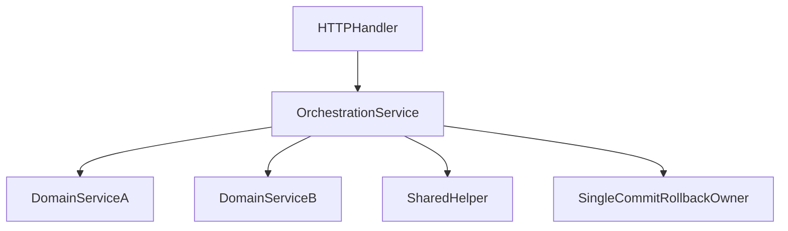

# Plan B1 — Transactions Backend

## Objectif

Faire de B1 un chantier strictement transactionnel : un seul propriétaire `commit/rollback` par requête mutante, aucun helper partagé ne commit, et aucune logique métier supplémentaire introduite pendant le refactor.

## Stratégie cible

- Cible d’architecture : le **service d’orchestration** devient propriétaire de la transaction.
- Les handlers HTTP de `[server/handlers/](D:/Mathakine/server/handlers/)` ne gardent que : parsing, validation transport, appel service, formatage de réponse.
- Les services feuilles et helpers partagés ne doivent plus appeler `commit()` s’ils sont réutilisés dans plusieurs flux.
- Les side effects externes (email, badge/streak si possible) doivent être pensés par rapport au point de commit pour éviter les persistances partielles.

## Constat de départ à traiter

- `[server/handlers/daily_challenge_handlers.py](D:/Mathakine/server/handlers/daily_challenge_handlers.py)` fait un `db.commit()` côté handler.
- `[server/handlers/exercise_handlers.py](D:/Mathakine/server/handlers/exercise_handlers.py)` fait un `db.commit()` dans `submit_answer()` alors que des services appelés plus bas peuvent déjà persister.
- `[server/handlers/challenge_handlers.py](D:/Mathakine/server/handlers/challenge_handlers.py)` fait aussi un `db.commit()` dans `submit_challenge_answer()` alors que `record_attempt()`, badges et streak peuvent déjà posséder des commits.
- `[app/services/auth_service.py](D:/Mathakine/app/services/auth_service.py)` concentre plusieurs commits service-side sur des flux auth/token/email.
- `[app/services/streak_service.py](D:/Mathakine/app/services/streak_service.py)` et `[app/services/badge_service.py](D:/Mathakine/app/services/badge_service.py)` restent des services partagés avec responsabilité transactionnelle propre.
- `[app/services/user_service.py](D:/Mathakine/app/services/user_service.py)` garde encore des commits sur des flux profil/session.

## Ordre d’implémentation recommandé

### Lot 1 — Inventory et convention transactionnelle

- Cartographier tous les `commit()/rollback()` réellement actifs dans `[app/services/](D:/Mathakine/app/services/)` et `[server/handlers/](D:/Mathakine/server/handlers/)`.
- Écrire une règle simple appliquée partout : “le flux appelant commit, les services partagés mutent seulement la session”.
- Identifier les services à rendre transaction-agnostiques en premier : `[app/services/streak_service.py](D:/Mathakine/app/services/streak_service.py)`, `[app/services/badge_service.py](D:/Mathakine/app/services/badge_service.py)`, parties réutilisées de `[app/services/auth_service.py](D:/Mathakine/app/services/auth_service.py)`.
- Sortie attendue : une liste courte `flow -> commit owner -> shared services to sanitize`.

### Lot 2 — Flux `daily_challenge` (plus faible risque)

- Cible principale : `[server/handlers/daily_challenge_handlers.py](D:/Mathakine/server/handlers/daily_challenge_handlers.py)` et `[app/services/daily_challenge_service.py](D:/Mathakine/app/services/daily_challenge_service.py)`.
- Déplacer la responsabilité transactionnelle hors du handler vers un service d’orchestration ou rendre explicite un point unique de commit côté service.
- Conserver `get_or_create_today()` et `_generate_today()` comme logique métier/fabrication sans commit multiple.
- Vérifier qu’aucun comportement de lecture/création du défi du jour ne change.

### Lot 3 — Flux `auth`

- Cibles : `[server/handlers/auth_handlers.py](D:/Mathakine/server/handlers/auth_handlers.py)`, `[server/handlers/user_handlers.py](D:/Mathakine/server/handlers/user_handlers.py)`, `[app/services/auth_service.py](D:/Mathakine/app/services/auth_service.py)`.
- Sous-flux : inscription, login, refresh, verify email, resend verification, forgot/reset password.
- Normaliser le point de commit par sous-flux et expliciter la place des side effects email/token.
- Réduire les commits multiples dans `create_user()` / `set_verification_token_for_new_user()` / `initiate_password_reset()` / `resend_verification_token()`.

### Lot 4 — Flux `profile`

- Cibles : `[server/handlers/user_handlers.py](D:/Mathakine/server/handlers/user_handlers.py)` et `[app/services/user_service.py](D:/Mathakine/app/services/user_service.py)`.
- Traiter : `update_user_me()`, changement de mot de passe connecté, révocation de session, suppression compte.
- Unifier la transaction autour du service d’orchestration et sortir les commits des helpers réutilisables si nécessaire.

### Lot 5 — Flux `exercise attempt`

- Cibles : `[server/handlers/exercise_handlers.py](D:/Mathakine/server/handlers/exercise_handlers.py)`, `[app/services/exercise_service.py](D:/Mathakine/app/services/exercise_service.py)`, `[app/services/badge_service.py](D:/Mathakine/app/services/badge_service.py)`, `[app/services/streak_service.py](D:/Mathakine/app/services/streak_service.py)`, `[app/services/daily_challenge_service.py](D:/Mathakine/app/services/daily_challenge_service.py)`.
- Supprimer le modèle actuel “handler commit + service commit + shared service commit”.
- Faire du flux de soumission un orchestrateur unique, quitte à laisser des wrappers de compatibilité temporaires dans les services partagés.

### Lot 6 — Flux `challenge attempt`

- Cibles : `[server/handlers/challenge_handlers.py](D:/Mathakine/server/handlers/challenge_handlers.py)`, `[app/services/logic_challenge_service.py](D:/Mathakine/app/services/logic_challenge_service.py)`, `[app/services/challenge_service.py](D:/Mathakine/app/services/challenge_service.py)`, `[app/services/badge_service.py](D:/Mathakine/app/services/badge_service.py)`, `[app/services/streak_service.py](D:/Mathakine/app/services/streak_service.py)`, `[app/services/daily_challenge_service.py](D:/Mathakine/app/services/daily_challenge_service.py)`.
- Même objectif que le lot exercice : un seul point de commit sur la tentative complète.
- Vérifier particulièrement les chemins où `record_attempt()`, badges et streak s’enchaînent.

## Garde-fous d’exécution

- Un seul flux par PR.
- Aucun refactor DRY hors B1 pendant ce chantier.
- Aucun changement de payload API tant que le lot ne l’exige pas.
- Si un service partagé est trop risqué à rendre transaction-agnostique d’un coup, introduire un chemin transitoire explicite plutôt qu’un refactor massif.
- Stop immédiat si des modifications inattendues apparaissent dans des fichiers hors périmètre du lot.

## Vérification obligatoire par lot

- Backend : tests unitaires ciblés sur les services touchés.
- Backend : tests API/intégration du flux touché.
- Global : `pytest` complet dès qu’un lot touche `badge_service`, `streak_service`, `auth_service` ou un flux de tentative.
- Vérifier explicitement qu’il n’y a plus qu’un propriétaire de `commit/rollback` sur le flux traité.

## Critère de fin B1

- Les flux critiques `daily_challenge`, `auth`, `profile`, `exercise attempt`, `challenge attempt` ont chacun un propriétaire transactionnel lisible.
- Les handlers n’orchestrent plus eux-mêmes plusieurs écritures transactionnelles.
- Les services partagés réutilisés par plusieurs flux ne possèdent plus de commit caché non documenté.
- Le chantier est terminé sans avoir mélangé B2 ou B3 dans les mêmes lots.

