# Diagrammes d'Architecture - Mathakine

Ce document présente l'architecture de Mathakine à travers différents diagrammes.

## Architecture Globale

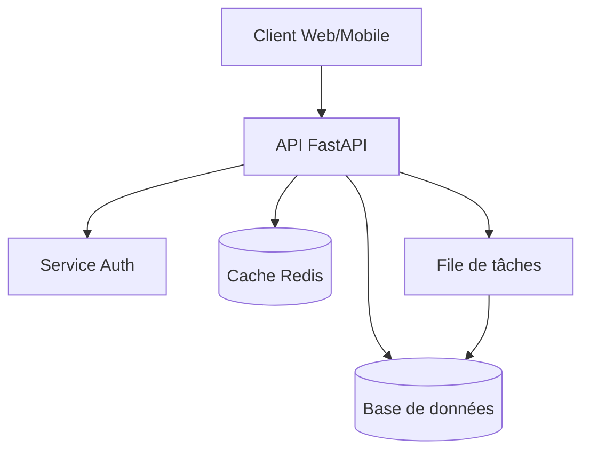

## Structure des Services

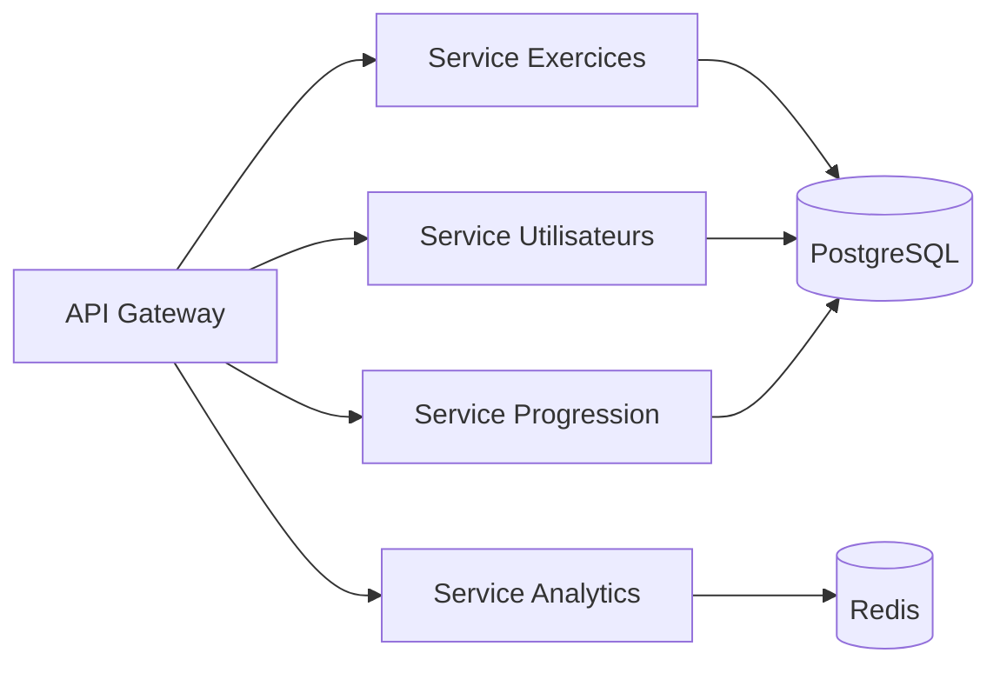

## Flux d'Authentification

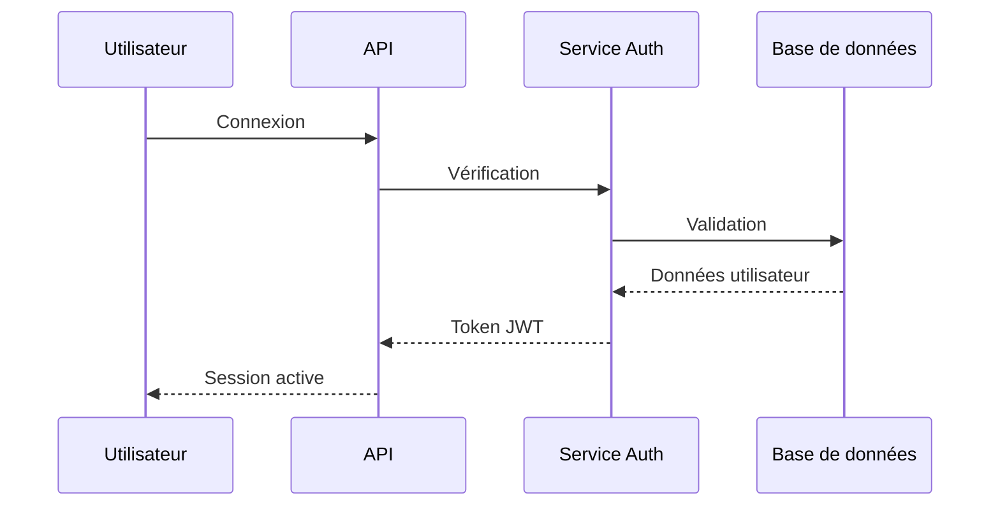

## Modèle de Données

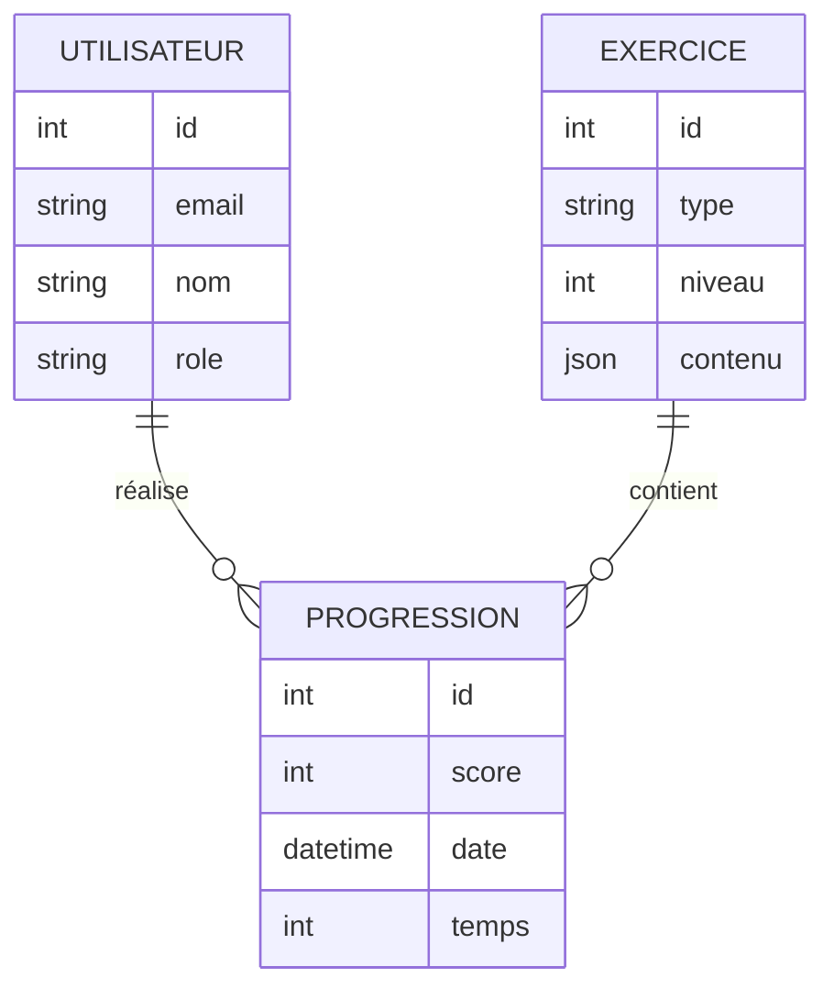

## Pipeline de Déploiement

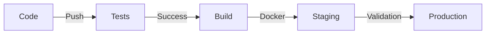

## Architecture des Tests

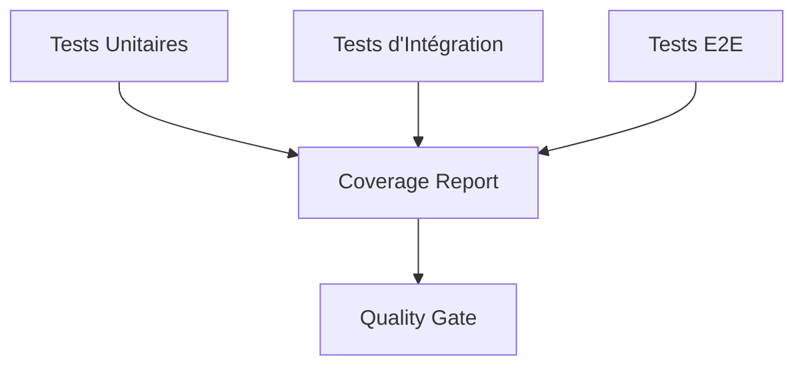

## Monitoring et Métriques

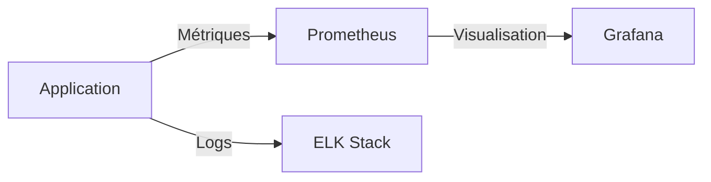

## Notes sur les Diagrammes

- Les diagrammes sont générés avec Mermaid
- Ils sont automatiquement mis à jour avec le code
- La documentation est versionnée avec le code

## Légende

- 🟦 Services principaux
- 🟨 Services auxiliaires
- 🟩 Bases de données
- 🟥 Points critiques
- ⚡ Flux de données

## Maintenance

Ces diagrammes sont maintenus par l'équipe d'architecture. Pour proposer des modifications :

1. Créer une issue avec le label `documentation`
2. Joindre le diagramme modifié
3. Expliquer les changements proposés

## Versions

- v1.0 : Architecture initiale
- v1.1 : Ajout du cache Redis
- v1.2 : Mise à jour du pipeline CI/CD
- v1.3 : Ajout du monitoring

# Diagrammes et visuels d'architecture

## Vue d'ensemble du système

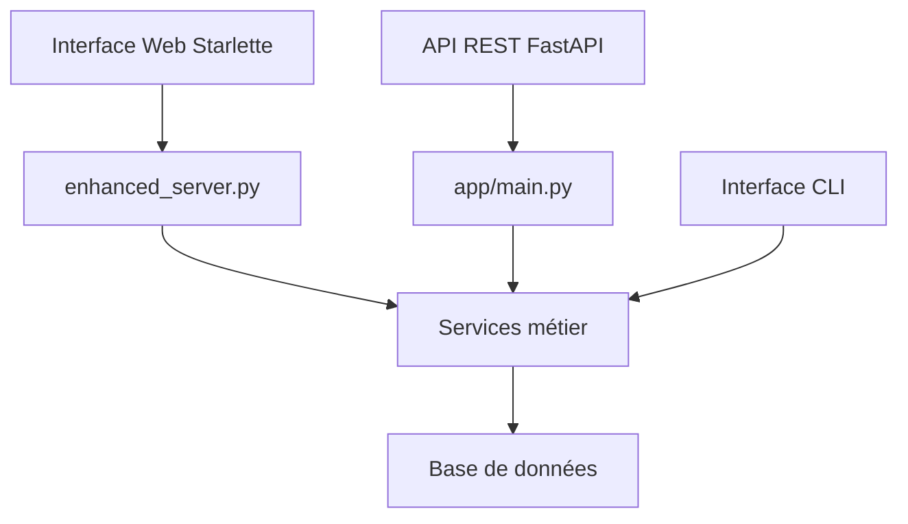

## Flux de données

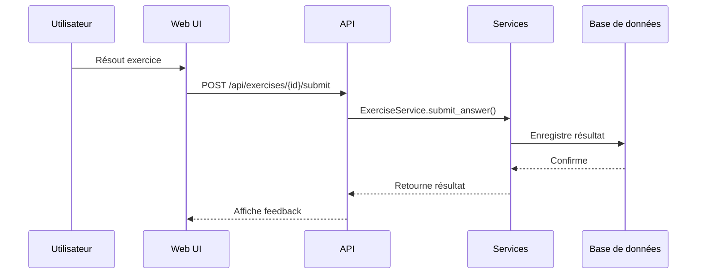

## Architecture des composants

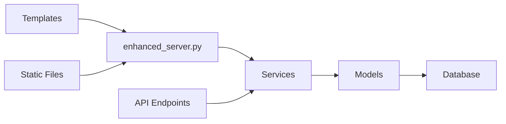

## Structure de la base de données

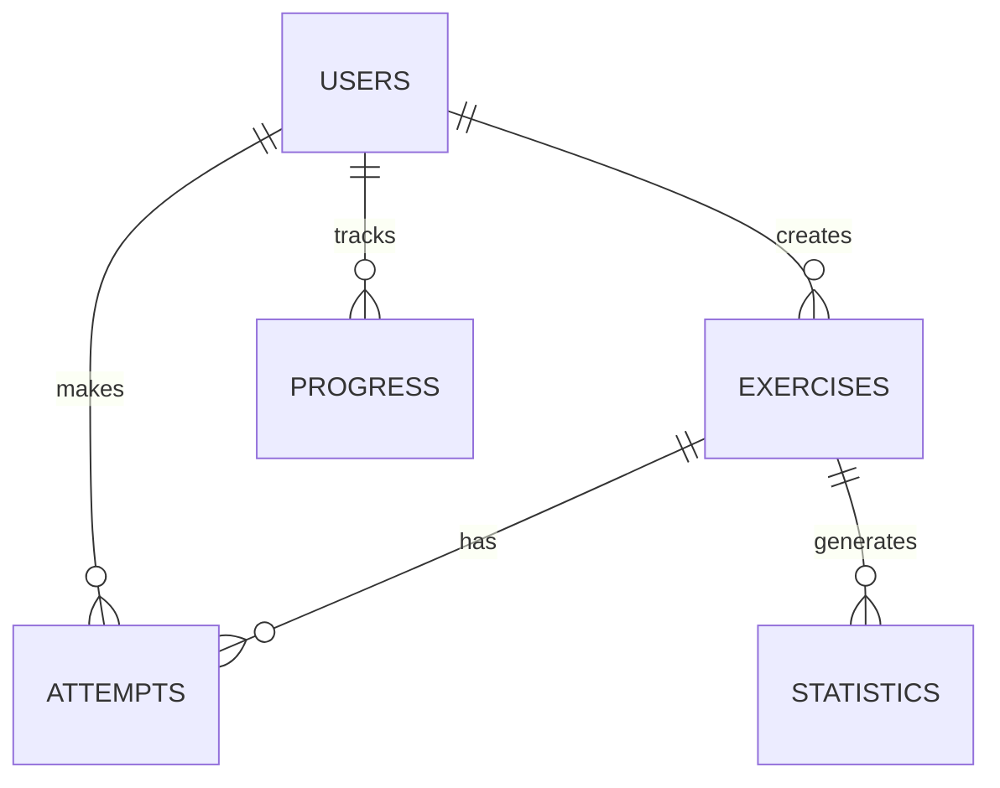

## Captures d'écran de l'interface

### Interface principale

*L'interface principale avec le thème Star Wars*

### Tableau de bord

*Le tableau de bord avec les statistiques*

### Exercice type

*Un exercice avec le design holographique*

## Flux d'utilisation typiques

### 1. Création d'un exercice
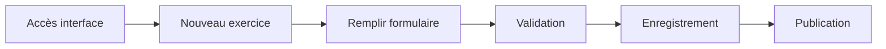

### 2. Résolution d'exercice
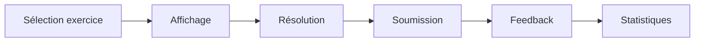

### 3. Suivi de progression
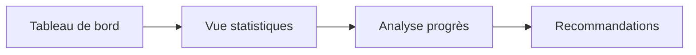

## Notes d'implémentation

1. **Interface utilisateur**
   - Composants Starlette pour le rendu
   - Templates Jinja2 pour les vues
   - CSS modulaire pour le thème

2. **API REST**
   - FastAPI pour les endpoints
   - Pydantic pour la validation
   - OpenAPI pour la documentation

3. **Base de données**
   - SQLAlchemy pour l'ORM
   - Alembic pour les migrations
   - PostgreSQL/SQLite pour le stockage

---

*Dernière mise à jour : 15 juin 2025* 