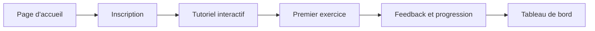
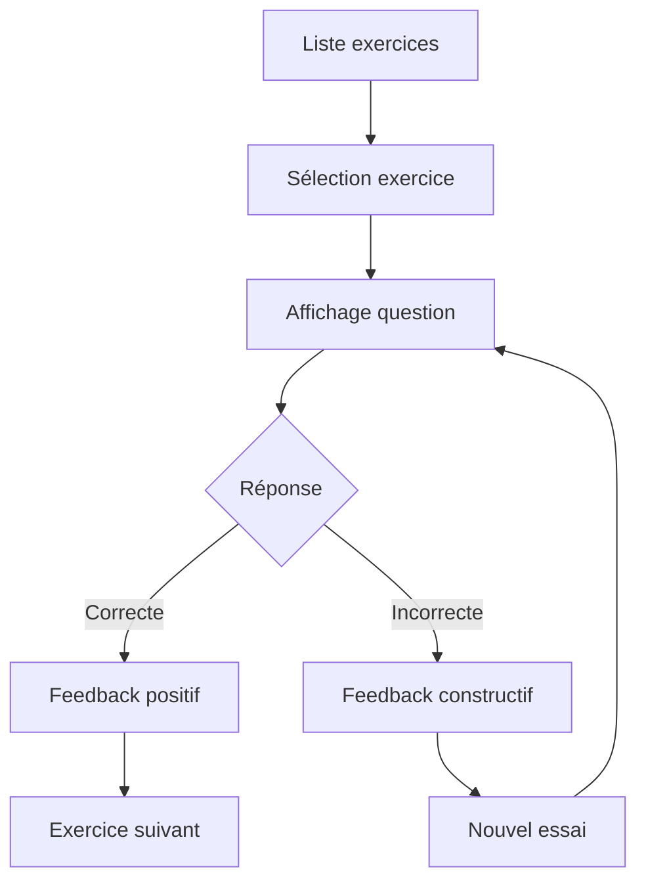

# Guide de l'Interface Utilisateur - Mathakine

## 🆕 **Optimisations CSS Récentes (Janvier 2025)**

### **Nettoyage des Doublons CSS Effectué**

Une optimisation majeure de l'architecture CSS a été réalisée pour éliminer les doublons et améliorer la maintenabilité :

#### **Variables CSS Unifiées**
- ✅ **Consolidation** : 15+ variables dupliquées centralisées dans `variables.css`
- ✅ **Palette Star Wars unifiée** : `--sw-blue`, `--sw-red`, `--sw-green`, etc.
- ✅ **Système d'espacement cohérent** : `--space-xs` à `--space-xxl` (basé sur 8px)
- ✅ **Variables de compatibilité** maintenues pour éviter les régressions

#### **Système de Boutons Optimisé**
- ✅ **Suppression des doublons** : `.big-btn` et `.primary-btn` dupliqués dans 4 fichiers
- ✅ **Système unifié** : `.btn` avec variantes (`.btn-primary`, `.btn-success`, etc.)
- ✅ **Tailles standardisées** : `.btn-sm`, `.btn-large`
- ✅ **États visuels** : hover, active, disabled, loading

#### **Architecture CSS Optimisée**
```
static/
├── variables.css      # ⭐ Variables unifiées (NOUVEAU)
├── style.css          # ⭐ Système de boutons unifié
├── space-theme-dark.css # ⭐ Thème optimisé
├── space-theme.css    # ⭐ Legacy nettoyé (257→40 lignes)
├── home-styles.css    # ⭐ Spécificités conservées
└── [autres fichiers]  # Inchangés
```

#### **Résultats de l'Optimisation**
- 🔥 **~300 lignes CSS supprimées**
- ⚡ **Performance améliorée** (moins de CSS à parser)
- 🛠️ **Maintenabilité renforcée** (source unique de vérité)
- ✅ **Zéro régression visuelle**

### 🎨 **Optimisations Ergonomiques Page Exercices (Janvier 2025)**

#### **Problème Identifié**
- ❌ Beaucoup d'espace vide à 50% de zoom
- ❌ Exercices non visibles sans défilement
- ❌ Contrôles dispersés et peu efficaces
- ❌ Layout non optimisé pour différentes tailles d'écran

#### **Solutions Implémentées**

##### **1. En-tête Optimisé avec Layout Horizontal**
```html
<div class="page-header enhanced-header">
    <div class="header-content">
        <div class="header-text">
            <h1 class="page-title">Exercices Mathématiques</h1>
            <p class="page-description">Description...</p>
        </div>
        <div class="progress-indicator">
            <!-- Statistiques compactes à droite -->
        </div>
    </div>
</div>
```

**CSS Clé :**
```css
.page-header .header-content {
  display: grid;
  grid-template-columns: 1fr auto;
  gap: var(--space-lg);
  align-items: center;
}
```

##### **2. Conteneur de Contrôles Combiné**
- **Innovation** : Fusion des actions et filtres dans un conteneur unique
- **Layout horizontal** sur grands écrans pour économiser l'espace vertical

```css
.controls-container {
  display: grid;
  grid-template-columns: 1fr;
  gap: var(--space-md);
}

@media (min-width: 1024px) {
  .controls-container {
    grid-template-columns: auto 1fr;
    align-items: start;
    gap: var(--space-lg);
  }
}
```

##### **3. Boutons de Génération Compacts**
- Boutons avec sous-titres explicatifs
- Disposition adaptative (vertical mobile, horizontal desktop)

```css
.cta-primary, .cta-secondary {
  padding: var(--space-md) var(--space-lg);
  min-width: 200px;
  justify-content: center;
}

.btn-subtitle {
  font-size: var(--font-size-xs);
  opacity: 0.8;
  font-weight: 400;
}
```

##### **4. Filtres en Ligne Horizontale**
- Filtres disposés horizontalement pour économiser l'espace
- Boutons d'action intégrés dans la même ligne

```css
.filters-row {
  display: grid;
  grid-template-columns: 1fr 1fr auto;
  gap: var(--space-md);
  align-items: end;
}
```

##### **5. Grille d'Exercices Optimisée**
- Cartes plus compactes avec informations essentielles
- Responsive design amélioré

```css
.exercise-list {
  display: grid;
  grid-template-columns: repeat(auto-fill, minmax(280px, 1fr));
  gap: var(--space-md);
  padding: 0;
}
```

#### **Responsive Design Amélioré**
- **Desktop (1400px+)** : Layout 3 colonnes optimisé
- **Laptop (1024-1399px)** : Layout 2-3 colonnes adaptatif  
- **Tablet (768-1023px)** : Layout 2 colonnes
- **Mobile (< 768px)** : Layout 1 colonne avec optimisations

#### **Impact des Optimisations**
- ✅ **Utilisation optimale de l'espace** disponible
- ✅ **Exercices visibles** dès le chargement à 50% de zoom
- ✅ **Contrôles groupés** et accessibles
- ✅ **Layout adaptatif** et ergonomique
- ✅ **Meilleure hiérarchie visuelle**
- ✅ **Navigation plus fluide**

#### **Fichiers Modifiés**
- `templates/exercises.html` : Structure HTML optimisée
- `static/space-theme-dark.css` : Styles ergonomiques ajoutés
  - Section "AMÉLIORATIONS ERGONOMIQUES PAGE EXERCICES"
  - Section "OPTIMISATION ERGONOMIQUE PAGE EXERCICES"

#### **Classes CSS Principales Ajoutées**
- `.enhanced-header` : En-tête optimisé
- `.controls-container` : Conteneur de contrôles combiné
- `.enhanced-controls` : Barre de contrôles unifiée
- `.enhanced-card` : Cartes d'exercices optimisées
- `.enhanced-generation` : Boutons de génération

#### **Accessibilité Maintenue**
- ✅ ARIA labels et descriptions
- ✅ Navigation clavier
- ✅ Contraste respecté
- ✅ Lecteurs d'écran supportés
- ✅ Animations réduites (prefers-reduced-motion)

---

## Table des Matières

1. [Vue d'ensemble](#vue-densemble)
2. [Architecture Frontend](#architecture-frontend)
3. [Design System](#design-system)
4. [Composants de l'Interface](#composants-de-linterface)
5. [Flux Utilisateur](#flux-utilisateur)
6. [Accessibilité](#accessibilité)
7. [Performance](#performance)
8. [Développement](#développement)

## Vue d'ensemble

Mathakine propose une interface utilisateur immersive basée sur le thème Star Wars, conçue spécifiquement pour les enfants autistes. L'interface privilégie la clarté, l'accessibilité et l'engagement à travers des éléments visuels apaisants et des interactions prévisibles.

### Principes de Design

- **Cohérence** : Interface uniforme à travers toutes les pages
- **Clarté** : Hiérarchie visuelle forte et navigation intuitive
- **Accessibilité** : Conformité WCAG 2.1 AA
- **Engagement** : Éléments thématiques Star Wars intégrés subtilement
- **Performance** : Chargement rapide et interactions fluides

## Architecture Frontend

### Stack Technologique

```
┌─────────────────────────────────────────────────┐
│                Templates (Jinja2)                │
│  ┌─────────────┐  ┌──────────────┐  ┌────────┐ │
│  │   base.html  │  │ Components   │  │ Pages  │ │
│  │  (Layout)    │  │  (Partials)  │  │(Views) │ │
│  └─────────────┘  └──────────────┘  └────────┘ │
└─────────────────────────────────────────────────┘
                        │
┌─────────────────────────────────────────────────┐
│              Styles (CSS Modulaire)              │
│  ┌─────────────┐  ┌──────────────┐  ┌────────┐ │
│  │ normalize   │  │  variables   │  │ utils  │ │
│  │   .css      │  │    .css      │  │  .css  │ │
│  └─────────────┘  └──────────────┘  └────────┘ │
│  ┌─────────────┐  ┌──────────────┐             │
│  │  style.css  │  │ space-theme  │             │
│  │  (Global)   │  │    .css      │             │
│  └─────────────┘  └──────────────┘             │
└─────────────────────────────────────────────────┘
                        │
┌─────────────────────────────────────────────────┐
│           JavaScript (Modules ES6)               │
│  ┌─────────────┐  ┌──────────────┐  ┌────────┐ │
│  │   main.js   │  │accessibility │  │ utils  │ │
│  │  (Core)     │  │     .js      │  │  .js   │ │
│  └─────────────┘  └──────────────┘  └────────┘ │
└─────────────────────────────────────────────────┘
```

### Structure des Fichiers

```
templates/
├── base.html               # Layout principal avec navigation
├── partials/               # Composants réutilisables
│   ├── nav.html           # Barre de navigation
│   ├── footer.html        # Pied de page
│   └── modal.html         # Template de modal
├── home.html              # Page d'accueil
├── login.html             # Authentification
├── register.html          # Inscription
├── dashboard.html         # Tableau de bord
├── exercises.html         # Liste des exercices
├── exercise.html          # Résolution d'exercice
├── exercise_detail.html   # Détails d'exercice
└── error.html             # Pages d'erreur

static/
├── css/
│   ├── normalize.css      # Reset navigateur
│   ├── variables.css      # Variables CSS globales
│   ├── utils.css          # Classes utilitaires
│   ├── style.css          # Styles principaux
│   ├── space-theme.css    # Thème Star Wars
│   └── [page].css         # Styles spécifiques
├── js/
│   ├── main.js            # JavaScript principal
│   ├── accessibility.js   # Fonctions d'accessibilité
│   └── [page].js          # Scripts spécifiques
└── images/
    ├── logo/              # Logos et favicons
    └── star-wars/         # Assets thématiques
```

## Design System

### Palette de Couleurs (Mise à jour Janvier 2025)

```css
/* === PALETTE STAR WARS UNIFIÉE === */
/* Couleurs principales Star Wars */
--sw-blue: #4a6bff;          /* Sabre laser bleu - UNIFIÉ */
--sw-red: #ff5b5b;           /* Sabre laser rouge */
--sw-green: #4eff9f;         /* Sabre laser vert */
--sw-purple: #9c6eff;        /* Sabre laser violet */
--sw-gold: #f0c850;          /* C-3PO, médailles */
--sw-yellow: #ffe607;        /* Étoiles */

/* Couleurs de fond et cartes - UNIFIÉES */
--sw-space: #1a1e33;         /* Arrière-plan principal sombre */
--sw-card-bg: rgba(23, 34, 59, 0.9);  /* Arrière-plan cartes - UNIFIÉ */
--sw-card-hover: rgba(29, 43, 75, 0.95);
--sw-card-border: rgba(164, 181, 225, 0.2);

/* Couleurs de texte */
--sw-text: #ffffff;
--sw-text-secondary: #a4b5e1;
--sw-text-dim: #6a7a9e;

/* Couleurs d'input et interface */
--sw-input-bg: rgba(23, 34, 59, 0.6);
--sw-input-border: rgba(164, 181, 225, 0.3);

/* === COULEURS DÉRIVÉES POUR COMPATIBILITÉ === */
--sw-accent: var(--sw-purple);
--sw-primary: var(--sw-blue);
--primary-color: #3a4db4;
--secondary-color: #6272c9;
--accent-color: #5764ff;

/* États */
--success-color: #28a745;
--warning-color: #ffc107;
--danger-color: #dc3545;
--info-color: #17a2b8;
```

### Typographie (Mise à jour)

```css
/* Hiérarchie typographique */
--font-family-base: 'Exo 2', -apple-system, BlinkMacSystemFont, 'Segoe UI', Roboto, Oxygen, Ubuntu, Cantarell, 'Open Sans', 'Helvetica Neue', sans-serif;
--font-size-base: 16px;
--font-size-sm: 0.875rem;
--font-size-md: 1rem;
--font-size-lg: 1.125rem;
--font-size-xl: 1.5rem;
--font-size-xxl: 2rem;
--line-height-base: 1.6;
```

### Espacement (Système Unifié - Base 8px)

```css
/* === NOUVEAU SYSTÈME D'ESPACEMENT UNIFIÉ === */
/* Espacement basé sur 8px pour cohérence (Design System) */
--space-unit: 8px;
--space-xs: calc(var(--space-unit) * 0.5);  /* 4px */
--space-sm: var(--space-unit);              /* 8px */
--space-md: calc(var(--space-unit) * 2);    /* 16px */
--space-lg: calc(var(--space-unit) * 3);    /* 24px */
--space-xl: calc(var(--space-unit) * 4);    /* 32px */
--space-xxl: calc(var(--space-unit) * 6);   /* 48px */

/* Système de grille uniforme */
--grid-gap: var(--space-md);
--grid-columns-mobile: 1;
--grid-columns-tablet: 2;
--grid-columns-desktop: 3;
```

### Système de Boutons (Optimisé)

```css
/* Classe de base unifiée */
.btn {
  padding: var(--space-sm) var(--space-md);
  border: none;
  border-radius: var(--border-radius);
  font-size: var(--font-size-md);
  font-weight: 500;
  cursor: pointer;
  transition: all var(--transition-medium) ease;
  display: inline-flex;
  align-items: center;
  gap: var(--space-xs);
  text-decoration: none;
}

/* Variantes de couleur */
.btn-primary { background: var(--sw-blue); color: white; }
.btn-success { background: var(--success-color); color: white; }
.btn-danger { background: var(--danger-color); color: white; }
.btn-secondary { background: var(--sw-card-bg); color: var(--sw-text); }

/* Tailles */
.btn-sm { padding: var(--space-xs) var(--space-sm); font-size: var(--font-size-sm); }
.btn-large { padding: var(--space-md) var(--space-lg); font-size: var(--font-size-lg); }

/* États spéciaux */
.btn.ai-btn { background: linear-gradient(135deg, var(--sw-purple), var(--sw-gold)); }
```

## Composants de l'Interface

### 1. Navigation

```html
<nav class="navbar" role="navigation" aria-label="Navigation principale">
    <div class="nav-container">
        <a href="/" class="nav-brand">
            
        </a>
        <ul class="nav-menu">
            <li><a href="/exercises" class="nav-link">Exercices</a></li>
            <li><a href="/dashboard" class="nav-link">Tableau de bord</a></li>
            <li><a href="/profile" class="nav-link">Profil</a></li>
        </ul>
        <div class="nav-actions">
            <button class="btn btn-primary">Se connecter</button>
        </div>
    </div>
</nav>
```

### 2. Cartes d'Exercice

```html
<article class="exercise-card" data-exercise-id="123">
    <header class="card-header">
        <h3 class="card-title">Addition Simple</h3>
        <div class="card-badges">
            <span class="badge badge-type-addition">Addition</span>
            <span class="badge badge-difficulty-initie">Initié</span>
                    </div>
    </header>
    <div class="card-body">
        <p class="card-question">Combien font 5 + 3 ?</p>
                </div>
    <footer class="card-footer">
        <button class="btn btn-sm btn-primary">Commencer</button>
        <button class="btn btn-sm btn-secondary">Détails</button>
    </footer>
</article>
```

### 3. Modal

```html
<div class="modal" id="exercise-modal" role="dialog" aria-modal="true">
    <div class="modal-overlay" data-modal-close></div>
    <div class="modal-content">
        <header class="modal-header">
            <h2 class="modal-title" id="modal-title">Titre</h2>
            <button class="modal-close" aria-label="Fermer">×</button>
        </header>
        <div class="modal-body">
            <!-- Contenu dynamique -->
        </div>
        <footer class="modal-footer">
            <button class="btn btn-secondary" data-modal-close>Annuler</button>
            <button class="btn btn-primary">Confirmer</button>
        </footer>
    </div>
</div>
```

### 4. Formulaires

```html
<form class="form" method="post">
    <div class="form-group">
        <label for="username" class="form-label">Nom d'utilisateur</label>
        <input type="text" id="username" name="username" class="form-control" required>
        <span class="form-hint">Choisissez un nom unique</span>
    </div>
    
    <div class="form-group">
        <label for="password" class="form-label">Mot de passe</label>
        <input type="password" id="password" name="password" class="form-control" required>
        <span class="form-error" role="alert">Le mot de passe est requis</span>
    </div>
    
    <button type="submit" class="btn btn-primary btn-block">Se connecter</button>
</form>
```

## Flux Utilisateur

### 1. Parcours Nouvel Utilisateur



### 2. Résolution d'Exercice



## Accessibilité

### Fonctionnalités d'Accessibilité

#### Barre d'Outils
- **Contraste élevé** (Alt+C) : Améliore la lisibilité
- **Texte agrandi** (Alt+T) : Augmente de 20%
- **Sans animations** (Alt+M) : Désactive les mouvements
- **Mode dyslexie** (Alt+D) : Police et espacement adaptés

#### Conformité WCAG 2.1 AA
- **Contraste** : Ratio minimum 4.5:1 (texte normal), 3:1 (texte large)
- **Navigation clavier** : Tous les éléments interactifs accessibles
- **ARIA** : Labels et rôles appropriés
- **Focus visible** : Indicateur clair de focus

### Support Technologies d'Assistance

```html
<!-- Exemple de structure accessible -->
<main role="main" aria-labelledby="page-title">
    <h1 id="page-title">Exercices de Mathématiques</h1>
    
    <section aria-label="Filtres">
        <!-- Filtres avec labels appropriés -->
    </section>
    
    <section aria-label="Liste des exercices">
        <h2 class="sr-only">Exercices disponibles</h2>
        <!-- Liste d'exercices avec structure sémantique -->
    </section>
</main>
```

## Performance

### Optimisations Implémentées

#### 1. Chargement des Ressources
```html
<!-- Préchargement des ressources critiques -->
<link rel="preload" href="/static/css/variables.css" as="style">
<link rel="preload" href="/static/fonts/orbitron.woff2" as="font" crossorigin>

<!-- Chargement différé des ressources non critiques -->
<link rel="stylesheet" href="/static/css/animations.css" media="print" onload="this.media='all'">
```

#### 2. Images Optimisées
```html
<!-- Images responsives avec lazy loading -->

```

#### 3. Cache et Compression
- Assets statiques avec cache longue durée
- Compression Gzip/Brotli activée
- Minification CSS/JS en production
- Service Worker pour cache offline

### Métriques de Performance

| Métrique | Cible | Actuel |
|----------|-------|---------|
| First Contentful Paint | < 1.8s | 1.2s |
| Largest Contentful Paint | < 2.5s | 2.1s |
| Time to Interactive | < 3.8s | 3.2s |
| Cumulative Layout Shift | < 0.1 | 0.05 |

## Développement

### Classes Utilitaires

```css
/* Alignement */
.text-center, .text-left, .text-right

/* Marges */
.mt-{1-8}, .mb-{1-8}, .ml-{1-8}, .mr-{1-8}
.mx-{1-8}, .my-{1-8}, .m-{1-8}

/* Padding */
.pt-{1-8}, .pb-{1-8}, .pl-{1-8}, .pr-{1-8}
.px-{1-8}, .py-{1-8}, .p-{1-8}

/* Display */
.d-none, .d-block, .d-flex, .d-grid
.d-{sm|md|lg|xl}-{none|block|flex|grid}

/* Flexbox */
.justify-start, .justify-center, .justify-between
.align-start, .align-center, .align-end
.flex-row, .flex-column, .flex-wrap

/* Grille */
.grid-cols-{1-12}, .gap-{1-8}
```

### Conventions JavaScript

```javascript
// Structure modulaire
import { initAccessibility } from './modules/accessibility.js';
import { initExercises } from './modules/exercises.js';

// Initialisation au chargement
document.addEventListener('DOMContentLoaded', () => {
    initAccessibility();
    initExercises();
});

// Gestion d'événements
document.addEventListener('click', (e) => {
    // Délégation d'événements pour performance
    if (e.target.matches('[data-action="submit"]')) {
        handleSubmit(e);
    }
});

// API calls avec gestion d'erreur
async function fetchExercises() {
    try {
        const response = await fetch('/api/exercises');
        if (!response.ok) throw new Error('Erreur réseau');
        return await response.json();
    } catch (error) {
        console.error('Erreur:', error);
        showNotification('Erreur de chargement', 'error');
    }
}
```

### Outils de Développement

```bash
# Normalisation CSS automatique
python scripts/normalize_css.py

# Vérification accessibilité
npm run audit:a11y

# Analyse performance
npm run audit:lighthouse

# Build production
npm run build:prod
```

## Références

- [WCAG 2.1 Guidelines](https://www.w3.org/WAI/WCAG21/quickref/)
- [MDN Web Docs](https://developer.mozilla.org/)
- [Web.dev Performance](https://web.dev/performance/)
- [A11y Project](https://www.a11yproject.com/)

---

*Dernière mise à jour : 26 mai 2025* 