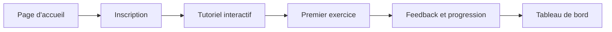
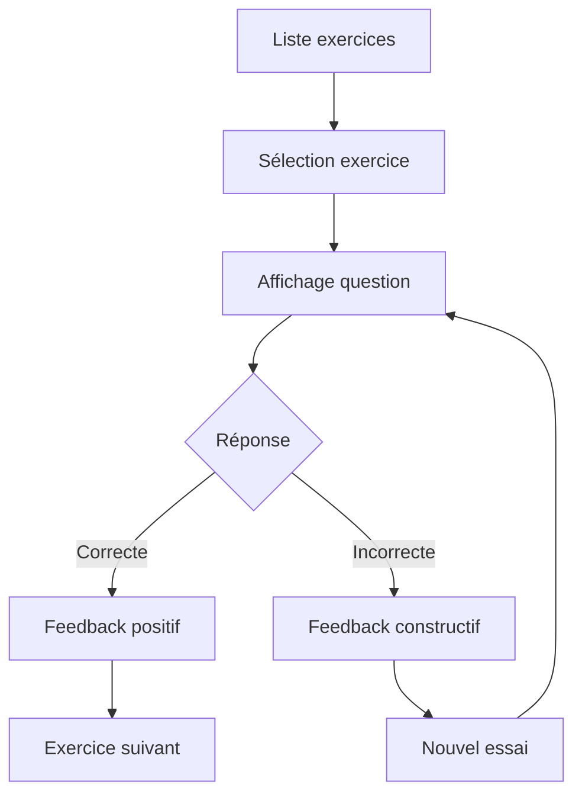

# Guide de l'Interface Utilisateur - Mathakine

## Table des Matières

1. [Vue d'ensemble](#vue-densemble)
2. [Architecture Frontend](#architecture-frontend)
3. [Design System](#design-system)
4. [Composants de l'Interface](#composants-de-linterface)
5. [Flux Utilisateur](#flux-utilisateur)
6. [Accessibilité](#accessibilité)
7. [Performance](#performance)
8. [Développement](#développement)

## Vue d'ensemble

Mathakine propose une interface utilisateur immersive basée sur le thème Star Wars, conçue spécifiquement pour les enfants autistes. L'interface privilégie la clarté, l'accessibilité et l'engagement à travers des éléments visuels apaisants et des interactions prévisibles.

### Principes de Design

- **Cohérence** : Interface uniforme à travers toutes les pages
- **Clarté** : Hiérarchie visuelle forte et navigation intuitive
- **Accessibilité** : Conformité WCAG 2.1 AA
- **Engagement** : Éléments thématiques Star Wars intégrés subtilement
- **Performance** : Chargement rapide et interactions fluides

## Architecture Frontend

### Stack Technologique

```
┌─────────────────────────────────────────────────┐
│                Templates (Jinja2)                │
│  ┌─────────────┐  ┌──────────────┐  ┌────────┐ │
│  │   base.html  │  │ Components   │  │ Pages  │ │
│  │  (Layout)    │  │  (Partials)  │  │(Views) │ │
│  └─────────────┘  └──────────────┘  └────────┘ │
└─────────────────────────────────────────────────┘
                        │
┌─────────────────────────────────────────────────┐
│              Styles (CSS Modulaire)              │
│  ┌─────────────┐  ┌──────────────┐  ┌────────┐ │
│  │ normalize   │  │  variables   │  │ utils  │ │
│  │   .css      │  │    .css      │  │  .css  │ │
│  └─────────────┘  └──────────────┘  └────────┘ │
│  ┌─────────────┐  ┌──────────────┐             │
│  │  style.css  │  │ space-theme  │             │
│  │  (Global)   │  │    .css      │             │
│  └─────────────┘  └──────────────┘             │
└─────────────────────────────────────────────────┘
                        │
┌─────────────────────────────────────────────────┐
│           JavaScript (Modules ES6)               │
│  ┌─────────────┐  ┌──────────────┐  ┌────────┐ │
│  │   main.js   │  │accessibility │  │ utils  │ │
│  │  (Core)     │  │     .js      │  │  .js   │ │
│  └─────────────┘  └──────────────┘  └────────┘ │
└─────────────────────────────────────────────────┘
```

### Structure des Fichiers

```
templates/
├── base.html               # Layout principal avec navigation
├── partials/               # Composants réutilisables
│   ├── nav.html           # Barre de navigation
│   ├── footer.html        # Pied de page
│   └── modal.html         # Template de modal
├── home.html              # Page d'accueil
├── login.html             # Authentification
├── register.html          # Inscription
├── dashboard.html         # Tableau de bord
├── exercises.html         # Liste des exercices
├── exercise.html          # Résolution d'exercice
├── exercise_detail.html   # Détails d'exercice
└── error.html             # Pages d'erreur

static/
├── css/
│   ├── normalize.css      # Reset navigateur
│   ├── variables.css      # Variables CSS globales
│   ├── utils.css          # Classes utilitaires
│   ├── style.css          # Styles principaux
│   ├── space-theme.css    # Thème Star Wars
│   └── [page].css         # Styles spécifiques
├── js/
│   ├── main.js            # JavaScript principal
│   ├── accessibility.js   # Fonctions d'accessibilité
│   └── [page].js          # Scripts spécifiques
└── images/
    ├── logo/              # Logos et favicons
    └── star-wars/         # Assets thématiques
```

## Design System

### Palette de Couleurs

```css
/* Couleurs principales */
--sw-primary: #7765e3;      /* Violet principal */
--sw-secondary: #3db4f2;    /* Bleu secondaire */
--sw-accent: #ffd700;       /* Or d'accent */

/* Couleurs de fond */
--bg-dark: #1a1a2e;         /* Fond sombre */
--bg-medium: #2d2d44;       /* Fond moyen */
--bg-light: #3d3d5c;        /* Fond clair */

/* Couleurs de texte */
--text-primary: #ffffff;    /* Texte principal */
--text-secondary: #b8b8c8;  /* Texte secondaire */
--text-muted: #7c7c92;      /* Texte discret */

/* États */
--success: #4caf50;         /* Succès */
--warning: #ff9800;         /* Avertissement */
--error: #f44336;           /* Erreur */
--info: #2196f3;            /* Information */
```

### Typographie

```css
/* Hiérarchie typographique */
--font-family-base: -apple-system, BlinkMacSystemFont, 'Segoe UI', Roboto, sans-serif;
--font-family-heading: 'Orbitron', var(--font-family-base);
--font-family-mono: 'Fira Code', monospace;

/* Tailles */
--font-size-xs: 0.75rem;    /* 12px */
--font-size-sm: 0.875rem;   /* 14px */
--font-size-base: 1rem;     /* 16px */
--font-size-lg: 1.125rem;   /* 18px */
--font-size-xl: 1.25rem;    /* 20px */
--font-size-2xl: 1.5rem;    /* 24px */
--font-size-3xl: 1.875rem;  /* 30px */
--font-size-4xl: 2.25rem;   /* 36px */

/* Poids */
--font-weight-normal: 400;
--font-weight-medium: 500;
--font-weight-bold: 700;
```

### Espacement

```css
/* Système d'espacement (base 8px) */
--space-1: 0.25rem;  /* 4px */
--space-2: 0.5rem;   /* 8px */
--space-3: 1rem;     /* 16px */
--space-4: 1.5rem;   /* 24px */
--space-5: 2rem;     /* 32px */
--space-6: 3rem;     /* 48px */
--space-7: 4rem;     /* 64px */
--space-8: 6rem;     /* 96px */
```

## Composants de l'Interface

### 1. Navigation

```html
<nav class="navbar" role="navigation" aria-label="Navigation principale">
    <div class="nav-container">
        <a href="/" class="nav-brand">
            
        </a>
        <ul class="nav-menu">
            <li><a href="/exercises" class="nav-link">Exercices</a></li>
            <li><a href="/dashboard" class="nav-link">Tableau de bord</a></li>
            <li><a href="/profile" class="nav-link">Profil</a></li>
        </ul>
        <div class="nav-actions">
            <button class="btn btn-primary">Se connecter</button>
        </div>
    </div>
</nav>
```

### 2. Cartes d'Exercice

```html
<article class="exercise-card" data-exercise-id="123">
    <header class="card-header">
        <h3 class="card-title">Addition Simple</h3>
        <div class="card-badges">
            <span class="badge badge-type-addition">Addition</span>
            <span class="badge badge-difficulty-initie">Initié</span>
        </div>
    </header>
    <div class="card-body">
        <p class="card-question">Combien font 5 + 3 ?</p>
    </div>
    <footer class="card-footer">
        <button class="btn btn-sm btn-primary">Commencer</button>
        <button class="btn btn-sm btn-secondary">Détails</button>
    </footer>
</article>
```

### 3. Modal

```html
<div class="modal" id="exercise-modal" role="dialog" aria-modal="true">
    <div class="modal-overlay" data-modal-close></div>
    <div class="modal-content">
        <header class="modal-header">
            <h2 class="modal-title" id="modal-title">Titre</h2>
            <button class="modal-close" aria-label="Fermer">×</button>
        </header>
        <div class="modal-body">
            <!-- Contenu dynamique -->
        </div>
        <footer class="modal-footer">
            <button class="btn btn-secondary" data-modal-close>Annuler</button>
            <button class="btn btn-primary">Confirmer</button>
        </footer>
    </div>
</div>
```

### 4. Formulaires

```html
<form class="form" method="post">
    <div class="form-group">
        <label for="username" class="form-label">Nom d'utilisateur</label>
        <input type="text" id="username" name="username" class="form-control" required>
        <span class="form-hint">Choisissez un nom unique</span>
    </div>
    
    <div class="form-group">
        <label for="password" class="form-label">Mot de passe</label>
        <input type="password" id="password" name="password" class="form-control" required>
        <span class="form-error" role="alert">Le mot de passe est requis</span>
    </div>
    
    <button type="submit" class="btn btn-primary btn-block">Se connecter</button>
</form>
```

## Flux Utilisateur

### 1. Parcours Nouvel Utilisateur



### 2. Résolution d'Exercice



## Accessibilité

### Fonctionnalités d'Accessibilité

#### Barre d'Outils
- **Contraste élevé** (Alt+C) : Améliore la lisibilité
- **Texte agrandi** (Alt+T) : Augmente de 20%
- **Sans animations** (Alt+M) : Désactive les mouvements
- **Mode dyslexie** (Alt+D) : Police et espacement adaptés

#### Conformité WCAG 2.1 AA
- **Contraste** : Ratio minimum 4.5:1 (texte normal), 3:1 (texte large)
- **Navigation clavier** : Tous les éléments interactifs accessibles
- **ARIA** : Labels et rôles appropriés
- **Focus visible** : Indicateur clair de focus

### Support Technologies d'Assistance

```html
<!-- Exemple de structure accessible -->
<main role="main" aria-labelledby="page-title">
    <h1 id="page-title">Exercices de Mathématiques</h1>
    
    <section aria-label="Filtres">
        <!-- Filtres avec labels appropriés -->
    </section>
    
    <section aria-label="Liste des exercices">
        <h2 class="sr-only">Exercices disponibles</h2>
        <!-- Liste d'exercices avec structure sémantique -->
    </section>
</main>
```

## Performance

### Optimisations Implémentées

#### 1. Chargement des Ressources
```html
<!-- Préchargement des ressources critiques -->
<link rel="preload" href="/static/css/variables.css" as="style">
<link rel="preload" href="/static/fonts/orbitron.woff2" as="font" crossorigin>

<!-- Chargement différé des ressources non critiques -->
<link rel="stylesheet" href="/static/css/animations.css" media="print" onload="this.media='all'">
```

#### 2. Images Optimisées
```html
<!-- Images responsives avec lazy loading -->

```

#### 3. Cache et Compression
- Assets statiques avec cache longue durée
- Compression Gzip/Brotli activée
- Minification CSS/JS en production
- Service Worker pour cache offline

### Métriques de Performance

| Métrique | Cible | Actuel |
|----------|-------|---------|
| First Contentful Paint | < 1.8s | 1.2s |
| Largest Contentful Paint | < 2.5s | 2.1s |
| Time to Interactive | < 3.8s | 3.2s |
| Cumulative Layout Shift | < 0.1 | 0.05 |

## Développement

### Classes Utilitaires

```css
/* Alignement */
.text-center, .text-left, .text-right

/* Marges */
.mt-{1-8}, .mb-{1-8}, .ml-{1-8}, .mr-{1-8}
.mx-{1-8}, .my-{1-8}, .m-{1-8}

/* Padding */
.pt-{1-8}, .pb-{1-8}, .pl-{1-8}, .pr-{1-8}
.px-{1-8}, .py-{1-8}, .p-{1-8}

/* Display */
.d-none, .d-block, .d-flex, .d-grid
.d-{sm|md|lg|xl}-{none|block|flex|grid}

/* Flexbox */
.justify-start, .justify-center, .justify-between
.align-start, .align-center, .align-end
.flex-row, .flex-column, .flex-wrap

/* Grille */
.grid-cols-{1-12}, .gap-{1-8}
```

### Conventions JavaScript

```javascript
// Structure modulaire
import { initAccessibility } from './modules/accessibility.js';
import { initExercises } from './modules/exercises.js';

// Initialisation au chargement
document.addEventListener('DOMContentLoaded', () => {
    initAccessibility();
    initExercises();
});

// Gestion d'événements
document.addEventListener('click', (e) => {
    // Délégation d'événements pour performance
    if (e.target.matches('[data-action="submit"]')) {
        handleSubmit(e);
    }
});

// API calls avec gestion d'erreur
async function fetchExercises() {
    try {
        const response = await fetch('/api/exercises');
        if (!response.ok) throw new Error('Erreur réseau');
        return await response.json();
    } catch (error) {
        console.error('Erreur:', error);
        showNotification('Erreur de chargement', 'error');
    }
}
```

### Outils de Développement

```bash
# Normalisation CSS automatique
python scripts/normalize_css.py

# Vérification accessibilité
npm run audit:a11y

# Analyse performance
npm run audit:lighthouse

# Build production
npm run build:prod
```

## Références

- [WCAG 2.1 Guidelines](https://www.w3.org/WAI/WCAG21/quickref/)
- [MDN Web Docs](https://developer.mozilla.org/)
- [Web.dev Performance](https://web.dev/performance/)
- [A11y Project](https://www.a11yproject.com/)

---

*Dernière mise à jour : 26 mai 2025* 