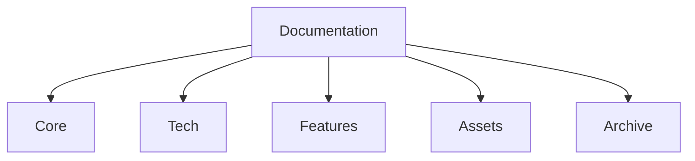

# Documentation Mathakine

Bienvenue dans la documentation de Mathakine. Cette documentation est organisée en trois sections principales pour faciliter la navigation et la compréhension du projet.

## 📚 Structure de la Documentation

## 🚀 Documents Principaux (Core/)

- [Guide de démarrage rapide](Core/QUICKSTART.md)
- [Guide de contribution](Core/CONTRIBUTING.md)
- [Diagrammes d'architecture](Core/ARCHITECTURE_DIAGRAMS.md)
- [FAQ](Core/FAQ.md)

## 💻 Documentation Technique (Tech/)

- [Guide de la base de données](Tech/DATABASE.md)
- [Guide des tests](Tech/TESTING.md)
- [Guide de déploiement](Tech/DEPLOYMENT.md)
- [Guide des API](Tech/API.md)
- [Guide de sécurité](Tech/SECURITY.md)

## ✨ Documentation Fonctionnelle (Features/)

- [Exercices mathématiques](Features/EXERCISES.md)
- [Système de progression](Features/PROGRESSION.md)
- [Système de récompenses](Features/REWARDS.md)
- [Mode hors-ligne](Features/OFFLINE.md)
- [Analytics](Features/ANALYTICS.md)

## 📦 Ressources

- [Changelog](CHANGELOG.md)
- [Glossaire](GLOSSARY.md)
- [Licence](../LICENSE)

## 🔍 Navigation Rapide

### Pour les Nouveaux Utilisateurs
1. [Guide de démarrage rapide](Core/QUICKSTART.md)
2. [FAQ](Core/FAQ.md)
3. [Guide des exercices](Features/EXERCISES.md)

### Pour les Développeurs
1. [Guide de contribution](Core/CONTRIBUTING.md)
2. [Architecture](Core/ARCHITECTURE_DIAGRAMS.md)
3. [Guide technique](Tech/DEVELOPMENT.md)

### Pour les Administrateurs
1. [Guide de déploiement](Tech/DEPLOYMENT.md)
2. [Guide de sécurité](Tech/SECURITY.md)
3. [Guide des opérations](Tech/OPERATIONS.md)

## 📅 Mises à jour

La documentation est mise à jour régulièrement. Consultez le [CHANGELOG.md](CHANGELOG.md) pour suivre les modifications.

## 🤝 Contribution

Nous encourageons les contributions à la documentation. Consultez le [guide de contribution](Core/CONTRIBUTING.md) pour plus d'informations.

## 📫 Contact

Pour toute question sur la documentation :
- Ouvrir une issue avec le label `documentation`
- Email : docs@mathakine.fr
- Discord : [canal #documentation](https://discord.mathakine.fr)

---

© 2024-2025 Équipe Mathakine - [mathakine.fr](https://mathakine.fr)